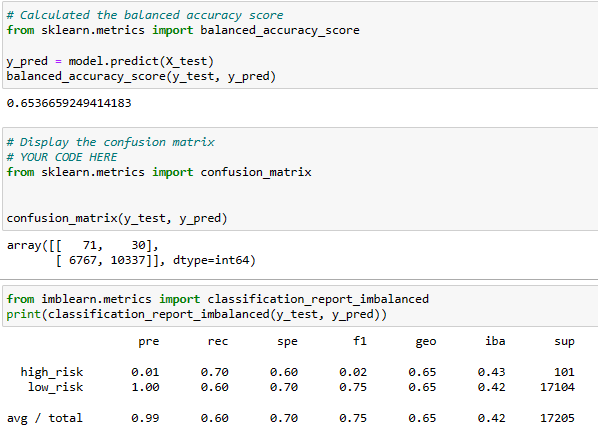
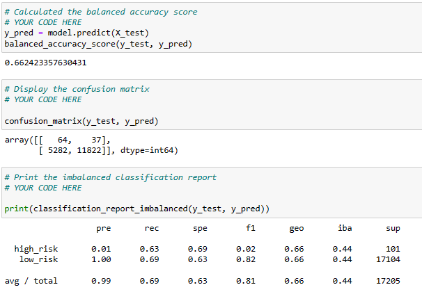
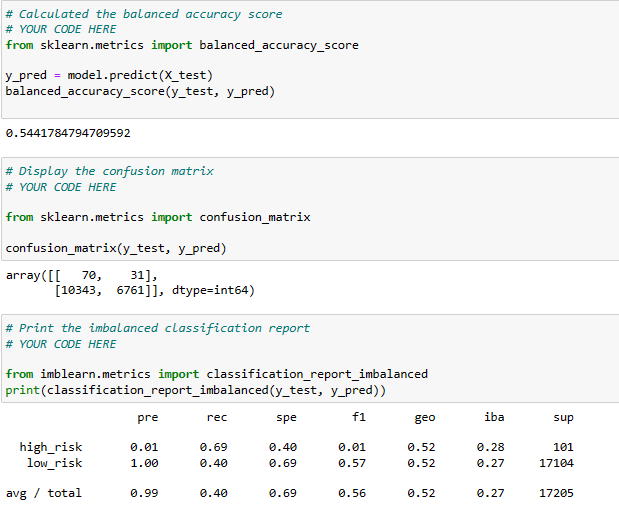
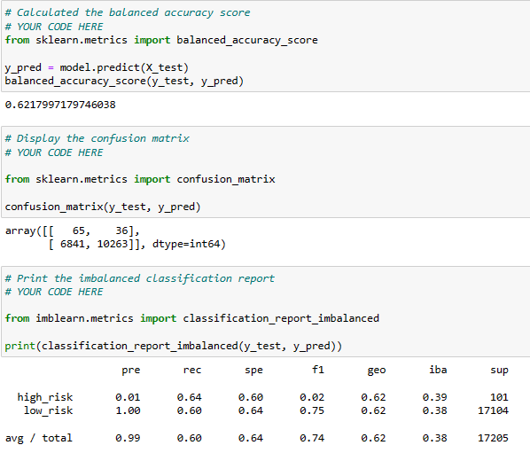
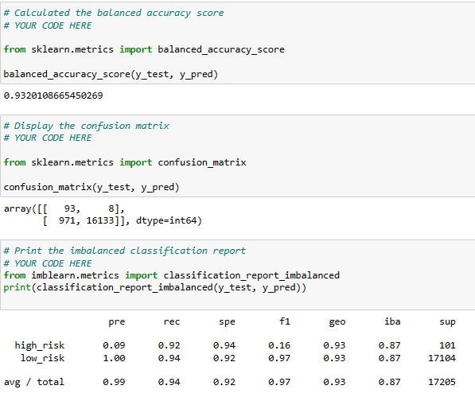

# Credit_Risk_Analysis

## 1. Overview of the analysis:
    Over the time it is observed that Credit risk is the possibility of a loss resulting from a borrower's failure to repay a loan or meet contractual obligations. This results in an interruption of cash flows and increased costs for collection and other complications. Although it's impossible to know exactly who will default on obligations, properly assessing and managing credit risk can lessen the severity of a loss. Therefore, we need to employ different techniques to train and evaluate models with unbalanced classes. We are going to test "BalancedRandomForestClassifier"/ "EasyEnsenleClass" / resampling tests which help us to predict credit risk.

## 2. Results:

### Resampling Models:
1.  RandomOverSampler:

    This model has accuracy 0.65, preceision: 1.0 and recall: 0.60.

2. SMOTE:

    

    This model has accuracy 0.66, preceision: 1.0 and recall: 0.69.

3. undersampling ClusterCentroids:

    

    This model has accuracy 0.54, preceision: 1.0 and recall: 0.40.

4. Combination Sampling:

    

    This model has accuracy 0.62, preceision: 1.0 and recall: 0.60.

5. Ensemble Balanced Random Forest:

    

    This model has accuracy 0.77, preceision: 1.0 and recall: 0.87.

6. Easy Ensemble AdaBoost:

    

    This model has accuracy 0.93, preceision: 1.0 and recall: 0.94.

## 3. Summary:

   *  We have run six differetn model and we have obtained accuracy, precision, recall, F1 values. 
   * All model has provided good precision level but observed variation in recall and accuracy.
   * It is observed that different model has different accuracy which vary from 0.54 to 0.93. 
   * However in all obtained results we have observed that model# 6 ( Easy Ensemble AdaBoost ) provided best results. it has highest accuracy/ highest recall as well as high precision.

    