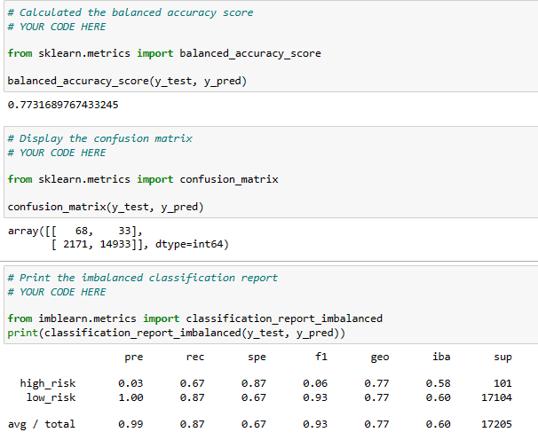

# Credit_Risk_Analysis

## 1. Overview of the analysis:
    Over the time it is observed that Credit risk is the possibility of a loss resulting from a borrower's failure to repay a loan or meet contractual obligations. This results in an interruption of cash flows and increased costs for collection and other complications. Although it's impossible to know exactly who will default on obligations, properly assessing and managing credit risk can lessen the severity of a loss. Therefore, we need to employ different techniques to train and evaluate models with unbalanced classes. We are going to test "BalancedRandomForestClassifier"/ "EasyEnsenleClass" / resampling tests which help us to predict credit risk.

## 2. Results:

### Resampling Models:
1.  RandomOverSampler:

2. SMOTE:

    

3. undersampling ClusterCentroids:

    

4. Combination Sampling:

    

5. Ensemble Balanced Random Forest:

    

6. Easy Ensemble AdaBoost:

    

## 3. Summary:

    